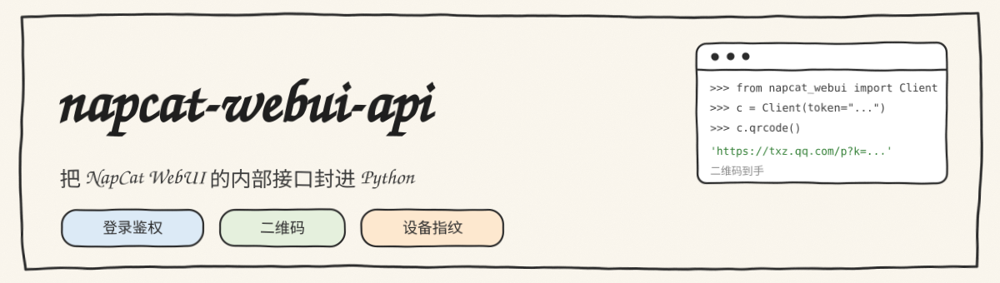
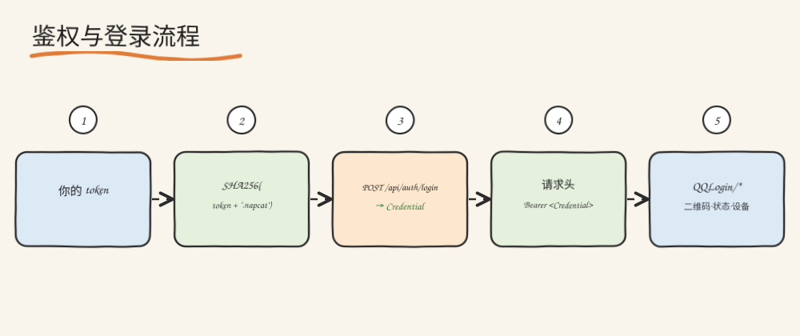

<div align="center">



[](https://www.python.org/)
[](https://www.python-httpx.org/)
[](./LICENSE)

NapCat WebUI 内部管理接口的异步 Python 封装：登录鉴权、二维码、登录状态、设备管理。

</div>

---

## 背景

NapCat 对外提供 OneBot HTTP/WS 接口用于消息收发，但其 **WebUI 管理接口**（登录、二维码、设备指纹等）没有官方 SDK。在无图形界面的服务器上，自动化地取二维码、查登录状态、备份设备信息，需要手动构造请求。

本项目把这一层封装出来。需要说明的是：**这不是官方公开 API，属于对 WebUI 内部接口的封装，跨版本可能失效**，请自行评估使用风险。

---

## 鉴权流程

<div align="center">

</div>

WebUI 的鉴权基于一个确定性哈希：

```
hash = SHA256(token + ".napcat")            # hex
POST /api/auth/login  {"hash": hash, "totpCode": ""}
    → data.Credential                        # 一段会话凭证
后续所有请求：
    Authorization: Bearer <Credential>
```

`token` 即 WebUI 配置里的 `token`（`webui.json`）。本库负责计算哈希、获取并缓存 `Credential`、在每次请求中注入 Bearer 头；凭证过期时自动重新登录。

---

## 快速开始

```python
import asyncio
from napcat_webui import Client

async def main():
    async with Client(base_url="http://127.0.0.1:6099", token="your-webui-token") as c:
        status = await c.login_status()   # 登录阶段、是否在线、coreReady
        print(status)

        qr = await c.qrcode()             # 当前登录二维码链接
        print(qr)

        print(await c.device_guid())      # 当前设备 GUID

asyncio.run(main())
```

---

## 模块

| 模块 | 能力 |
|---|---|
| `auth` | 计算 `SHA256(token + ".napcat")`，换取并缓存 `Credential` |
| `client` | 基于 httpx.AsyncClient 的异步封装，自动注入 Bearer，处理凭证过期重登 |
| `login` | 二维码获取与刷新、登录状态轮询、快速登录、密码/验证码/新设备登录 |
| `device` | 设备 GUID / MAC / machine-id 的读取、备份、恢复与重置 |

涉及的 WebUI 端点（部分）：

```
POST /api/auth/login
POST /api/QQLogin/CheckLoginStatus
POST /api/QQLogin/GetQQLoginQrcode
POST /api/QQLogin/RefreshQRcode
POST /api/QQLogin/GetQuickLoginList
POST /api/QQLogin/SetQuickLogin
POST /api/QQLogin/GetDeviceGUID
POST /api/QQLogin/SetDeviceGUID
POST /api/QQLogin/GetLinuxMAC
...
```

---

## 设计说明

**异步优先**：多数量化服务器场景需要在一个事件循环里同时轮询登录状态、拉二维码、处理业务；因此底层统一用 `httpx.AsyncClient`。

**凭证生命周期**：`Credential` 不是永久有效的。客户端在首次请求时登录并缓存，遇到 401/403 时自动重新执行一次登录握手，再重放原请求。

**错误处理**：WebUI 常以 HTTP 200 返回业务错误（`{"code": ..., "message": ...}`），因此除了 HTTP 状态码，还会检查响应体的 `code` 字段。

---

## 兼容性

| 项 | 说明 |
|---|---|
| NapCat | 在 4.18.x 上验证；WebUI 内部接口可能随版本变化 |
| Python | 3.9+ |
| 依赖 | `httpx` |

---

## 免责声明

- 本库封装的是 NapCat WebUI 的非官方内部接口，接口结构可能随版本变化，**不保证向后兼容**。
- 请仅用于你拥有管理权限的服务器与账号。
- 鉴权仍需要 WebUI token 本身，本库只是自动化封装，不绕过任何访问控制。

## License

[MIT](./LICENSE)
